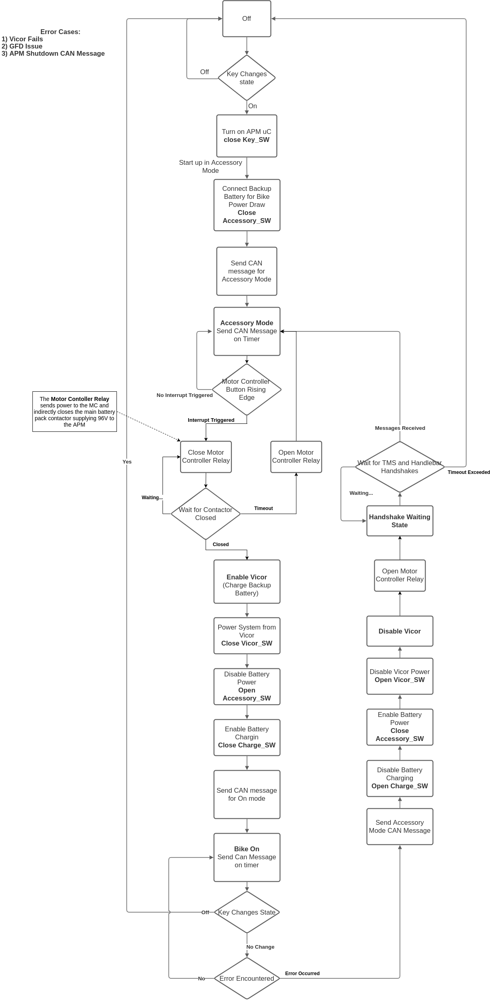

======
Design
======

This page outlines the design choices made for the APM.  It helps to understand
the device communication interfaces and state transitions.

APM Architecture
===========================
The APM Architecture is shown below.  Some of the switch and net names are outdated, but in general
this can show the overall architecture of the system.  For more comprehensive documentation please
see the APM confluence page at `APM Confluence <https://wiki.rit.edu/display/p21261>`_

.. image:: ../_static/images/Redundant_DEV1_APM_Architecture.png
   :width: 800
   :align: center

APM State Control Flowchart
===========================
The APM State control is shown in the below figure.  This denotes the state transitions

