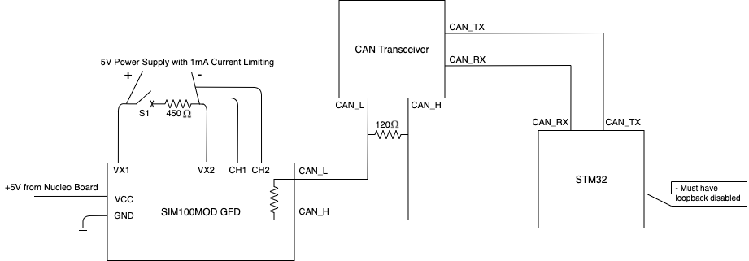

# SIM100 Test
## Overview
Written 09/13/21 by Dan Popp.
For documentation on SIM100 device see [SIM100](https://sendyne.com/Products/SIM100%20Isolation%20Monitor.html)

## Test Schematic

## Procedure
1) Set up circuit schematic as shown in the above figure.
   1) Note that the load connected to the SIM100 is not required, but may be useful for testing
2) Program the nucleo board with the sim100 target code
3) Enter and receive test messages utilizing the UART terminal.
   1) Enter 'h' for a list of commands